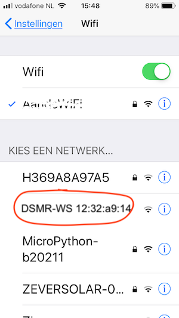

## (eerste keer) Opstarten
Na het flashen van de firmware en het uploaden van de `data`-map kun je de
DSMR-logger op de `P1` poort van de *Slimme Meter* aansluiten.

De DSMR logger zal nu opstarten. 
Heb je geen OLED-schermpje op je DSMR-logger aangesloten dan kun je, aan de hand
ven het gedrag van de `blauwe led` op de ESP-12 toch zien waar hij zich in het 
opstart proces bevindt.

| Status                |    | Blauw Led | Omschrijving | OLED scherm |
|:----------------------|:--:|:----------|:-------------|:-------------------|
| Normale werking       | 1  | Knippert 3x langzaam | Initiele start |\*DSMRloggerWS\* Connecting to WiFi|
|                       | 2  | Knippert 5x snel  | Verbonden met WiFi |&lt;IP-adres&gt; telnet&nbsp;started&nbsp;(23) HTTP&nbsp;server&nbsp;started wacht&nbsp;op&nbsp;Telegram|
|
|                       | 3  | Knippert om de 10 seconden | Verwerkt een telegram |Status Informatie|
| (fout! na 1 en 2)               | 3  | Blijft aan (of uit) | logger wacht op een telegram Controleer aansluitingen! Dit duidt op een probleem! |  ?? wacht op Telegram ??    |
| | | |
| Eerste keer opstarten | 1  | Knippert 3x langzaam | Initiele start |\*DSMRloggerWS\* Connecting to WiFi|
|                       | 2  | Blijft aan  | Access Point gestart |AP Mode Connect&nbsp;to DSMR-WS-&lt;mac&gt;|

Als de blauwe led blijft branden dan moeten de gegevens van jouw WiFi netwerk
nog worden ingevoerd zodat de DSMR-logger daar verbinding mee kan maken.

Met je computer/mobiel/tablet, ga je naar `Netwerk Instellingen` en
kijk je welke WiFi Access Points (AP) er allemaal zijn.

Als daar een WiFi AP met de naam `DSMR-WS xx-yy-zz` tussen staat
maak je daar verbinding mee.
Er kunnen nu twee dingen gebeuren:

1. Er verschijnt een popUp window waar je jouw WiFi netwerk kunt selecteren en het 
bijbehorende wachtwoord kunt invoeren;
2. Of er gebeurt niets. Ga dan met je browser naar `http://192.168.4.1/` waarna er 
een pagina verschijnt waarin je je WiFi netwerk kunt selecteren en het bijbehorende 
wachtwoord kunt invoeren.

Druk vervolgens op [`Save`].

De logger zal rebooten en verbinding maken met jouw WiFi router (zie: `Normale werking`).

Zet je computer/mobiel/tablet weer terug op je eigen WiFi netwerk.

Als de led, na de eerste drie keer langzaam knipperen blijft branden, dan kon de 
DSMR-logger geen verbinding met jouw WiFi netwerk maken en start hij weer zijn eigen 
AP op en zul je de WiFi procedure opnieuw moeten uitvoeren.

Als de DSMR-logger normaal is opgestart en de blauwe led knippert zo ongeveer iedere
tien seconden, ga dan met je browser naar:
`http://DSMR-WS.local/` of `http://<IPadresVanDeDSMRlogger>`

Als alles goed is gegaan zie je in de browser de hoofd-pagina van de DSMR-logger met 
daarin de actuele data uit de Slimme Meter.

Je kunt met `telnet DSMR-WS.local` of met `telnet <IPadresVanDeDSMRlogger>` inloggen op 
je DSMR-logger en volgen waar de DSMR-logger mee bezig is.

Om te bepalen welk IP is uitgegeven aan de ESP door de DHCP server, kun je in je `router` 
kijken, of met bijv. de `Fing app` of met `nmap`.

Een andere manier om achter het IP-adres van je DSMR-logger te komen is door de 
ArduinoIDE op te starten. 

Onder `Network Ports` staat de `DSMR-WS` als optie, met daarachter het IP adres (in dit
voorbeeld is dat `192.168.12.106`).

Uitzoeken

Vanaf versie 0.4.2 van de DSMRloggerWS firmware werkt bovenstaande misschien niet meer!

---

[3D boxje van Allard]
 

