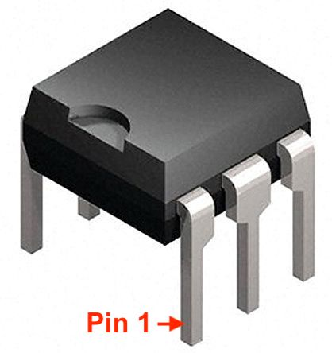
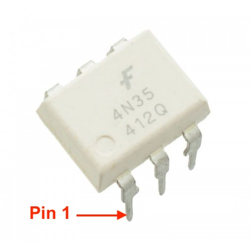

## Vragen en Antwoorden

* [Niet alles DSMR 4 is DSMR 4](#niet-alles-dsmr-4-is-dsmr-4)
* [5 Volt Programmer](#5-volt-programmer)
* [Tactile Switches](#tactile-switches)
* [PUYA Chip](#puya-chip)
* [Update of Upgrade](#update-of-upgrade)
* [Slave kanaal Gasmeter](#slave-kanaal-gasmeter)
* [Help! wat is pin 1 van mijn 4N35?](#help-wat-is-pin-1-van-mijn-4n35)
* [De rode Led knippert](#de-rode-led-knippert)
* [Wat zijn de maten van de DSMR-logger?](#wat-zijn-de-maten-van-de-dsmr-logger-v4)

<hr>

### Niet alles DSMR 4 is DSMR 4 ..
<div class="admonition note">
<p class="admonition-title">Mijn DSMR-logger doet het niet als ik hem op de Slimme Meter aansluit</p>
Er zijn Slimme Meters die 'zeggen' DSMR Versie 4
te volgen maar toch geen 5 volt met voldoende stroom leveren.
<br>Bouwers van de DSMR-logger hebben problemen gemeld met de <i><b>KAIFA</b> MA105A</i> en 
<i>MA105C</i> en met de <i><b>KAIFA</b> MA304</i>.
<br>Kijk bijvoorbeeld
<a href="https://willem.aandewiel.nl/index.php/2018/08/28/slimme-meter-uitlezer/#comment-368" target="_blank">
hier</a> en
<a href="https://willem.aandewiel.nl/index.php/2018/08/28/slimme-meter-uitlezer/#comment-334" target="_blank">
hier</a>.
<br>
<br>Dit probleem is op te lossen door de DSMR-logger op een externe (bijvoorbeeld USB) voeding
aan te sluiten.

</div>
<hr>

### 5 Volt Programmer
<div class="admonition note">
<p class="admonition-title">Kan ik met een 5 volt USB to TTL adaptor de DSMR-logger flashen?</p>
Als het een type is dat de TX en RX signalen op 3v3 levert (bijvoorbeeld 
<a href="https://opencircuit.nl/Product/12809/USB-to-TTL-Serial-Cable-Debug-Console-Cable-for-Raspberry-Pi" target="_blank">
deze</a>)
dan kán het wel, maar moet je de 5 Volt output op de 5 Volt pin van de DSMR-logger aansluiten.
Je moet hem dan zoals in het plaatje hieronder aansluiten.

</div>

<center>  </center>

<hr>

### Tactile Switches
<div class="admonition note">
<p class="admonition-title">Waarom heb ik een tacktile switch met een lange en één met een korte stift?</p>
De tacktile switch met de korte stift is de RESET switch. 
Eenmaal ingebouwd in een (project) box moet de FLASH switch bereikbaar blijven omdat hij
een dubbel functie heeft. 
Hij dient bij normaal gebruik om het oled-scherm 'wakker' te maken.
Vandaar de lange stift!
<br />
Deze lange stift maakt de switch wel erg kwetsbaar zolang de DSMR-logger niet in een (project) box
is ingebouwd. Als je er een niet <i><b>recht-naar-beneden</b></i> kracht op uitoefend, dan 
breekt hij makkelijk af!

</div>

<hr>

### PUYA Chip
<div class="admonition note">
<p class="admonition-title">Mijn versie 3 bordje met PUYA chip doet het niet</p>
Het heeft er alle schijn van dat de DSMRloggerWS firmware niet geschikt is voor
een ESP-01 (versie 3 bordje) met een PUYA flash chip.
<p>
Kijk ook <a href="../PUYA_patch/">hier</a>.
</div>

<hr>

### Update of Upgrade?
<div class="admonition note">
<p class="admonition-title">Wanneer moet ik updaten en wanneer upgraden?</p>
We doen een `update` als we de firmware willen vervangen met 
een nieuwere versie van dezelfde firmware (dus we vervangen DSMRlogger2HTTP door 
een nieuwere versie van DSMRlogger2HTTP óf we vervangen de DSMRloggerWS 
firmware door een nieuwere versie van de DSMRloggerWS firmware)

We doen een `upgrade` als we de ene firmware vervangen door een andere (dus
we vervangen bijvoorbeeld DSMRlogger2HTTP door DSMRloggerWS).

#### Update
Bij een `update` zal de lay-out van de data-bestanden niet veranderen en kun 
je volstaan met het opnieuw flashen van de firmware.    
Voor de data-map (SPIFFS) kun je twee wegen bewandelen.

1)
Je haalt m.b.v. de `FSexplorer` (of met DSMRlogger2HTTP `http://DSMR-ESP01.local/onderhoud`)
de `.html` en `.js` bestanden op uit de `data`-map en zet deze in SPIFFS

2)
Je haalt met de `FSexplorer` de `PRDxxxx.csv` bestanden op en zet deze in de `data`-map, 
waarna je met het `Data Upload Tool` de `data`-map naar SPIFFS kunt overzetten.

#### Upgrade
Bij een `upgrade` moet je zowel de firmware als de `data`-map opnieuw naar de
DSMR-logger flashen.   
Uiteraard kun je ook in dit geval éérst de `PRDxxxx.csv` bestanden uit de 
DSMR-logger halen en ergens op je computer bewaren. Met wat moeite kun je
de inhoud van deze bestanden omzetten in het nieuwe formaat en ze dan weer
terug zetten in de DSMR-logger.

</div>

<hr>

### Slave kanaal Gasmeter
<div class="admonition note">
<p class="admonition-title">Ik zie mijn gas-verbruik niet op de DSMR-logger</p>
<b>Eric</b> heeft dit voor ons uitgezocht en als commentaar 
<a href="https://willem.aandewiel.nl/index.php/2018/08/28/slimme-meter-uitlezer/#comment-200" target="_blank">
gepost</a>.     
Hieronder vind je de inhoud van zijn post.    
<br>
Het kan voorkomen dat de gasmeter niet op slave kanaal 1, maar op 2, 3 of 4 is aangesloten. 
Dit is op zich geen probleem, alleen gaat de `dsmr`-library er vanuit 
dat de gasmeter op kanaal 1 is aangesloten…
<br>
Lang verhaal kort, als je de arduino-dsmr library iets aanpast 
(MBUS instelling) en daarna de DSMRloggerWS firmware opnieuw compileerd en naar de
DSMR-logger V4 of de ESP-01 flashed, dan werk het geheel als een trein 🙂
   
Ik heb het volgende gedaan:

1. Login via Telnet op de DSMR-logger Versie 4
2. Laat een telegram verschijnen op je scherm (zie menu voor de juiste optie)
3. Ga op zoek naar de gasmeting. 

Een voorbeeld:
```
     0-2:24.1.0(003)
     0-2:96.1.0(47303033**************31333137)
     0-2:24.2.1(181202194007W)(00283.687*m3)
```
In een gangbare situatie staat hier normaal:
```
     0-1:24.1.0(003)
     0-1:96.1.0(47303033**************31333137)
     0-1:24.2.1(181202194007W)(00283.687*m3)
```
De <b>0-2</b> waarde geeft aan dat je gasmeter is aangesloten op kanaal twee van de slimme meter. 
Het kan echter ook dat de gasmeter op kanaal <b>0-3</b> of <b>0-4</b> is aangesloten.

Ga naar de arduino-dsmr library op je computer, deze is te vinden in de Arduino sketch 
directory er vervolgens in de libraries subdirectory. Je bent op zoek naar het bestand 
```fields.h```. Ergens rond regel 174 kom je de volgende constanten tegen:
```
  const uint8_t GAS_MBUS_ID = 1;
  const uint8_t WATER_MBUS_ID = 2;
  const uint8_t THERMAL_MBUS_ID = 3;
  const uint8_t SLAVE_MBUS_ID = 4;
```
De truc is om het ID achter GAS_MBUS_ID aan te passen naar het kanaal waar je gasmeter op staat. 
Vervolgens pas je, bijvoorbeeld, de watermeter (WATER_MBUS_ID) aan naar het andere ID.     
Resultaat bij mij:
```
  const uint8_t GAS_MBUS_ID = 2;
  const uint8_t WATER_MBUS_ID = 1;
  const uint8_t THERMAL_MBUS_ID = 3;
  const uint8_t SLAVE_MBUS_ID = 4;
```
Nu nog even de boel opslaan en over the air de firmware update (pure luxe dat dit kan). Vanaf nu 
kun je genieten van gasmetingen.     
Althans… Dat was bij mij het geval.

</div>
<hr>

### Help! Wat is pin 1 van mijn 4N35?
<div class="admonition note">
<p class="admonition-title">Hoe identificeer ik pin-1 van de optocoupler?</p>

<center>  </center>

Er zijn verschillende varianten van de 4N35 opto-coupler. Hieronder drie afbeeldingen
waarmee je kunt identificeren wat pin 1 van de 4N35 is:
<br>
<center>  </center>
<br>
<center>  </center>
<br>
<center>  </center>
<br>

</div>
<hr>

### De rode Led knippert 
<div class="admonition note">
<p class="admonition-title">Mijn rode (voedings) Led (D1) knippert en brand niet constant!</p>
Dit duidt er meestal op dat de voeding uit de Slimme Meter niet toerijkend is om
de DSMR-logger te voeden. Met name <i>Kaifa</i> Slimme Meters hebben hier last van.   
De oplossing bestaat eruit een externe (USB) voeding te gebruiken. Deze sluit
je aan op de <b>GND</b> en <b>+5V</b> pinnen van de DSMR-logger.      
Volgens 
<a href="https://willem.aandewiel.nl/index.php/2018/08/28/slimme-meter-uitlezer/#comment-368" target="_blank">
deze post</a>
(zie punt 4) moet je óók de 5 Volt vanuit de Slimme Meter onderbreken.   

Op de printplaat is dit vrij lastig (zeker als je hem al in elkaar gesoldeerd hebt). Het 
makkelijkste is dit in- of op de kabel te doen bijvoorbeeld door een stukje isolatie-tape
over <b>pin 1</b> te plakken.

<center>  </center>

Stop de gehackte RJ12 stekker in de DSMR-logger en niet in de Slimme Meter. Mocht het
stukje tape loslaten dan is het eenvoudiger deze uit de DSMR-logger te halen dan uit de
Slimme Meter.

</div>

### Wat zijn de maten van de DSMR-logger V4
<div class="admonition note">
<p class="admonition-title">Wat zijn de maten van de DSMR-logger V4?</p>

<center>  </center>

De buitenmaten zijn 67mm x 51mm.

<center>  </center>

De <b>J4</b> steekt 8,5mm boven de printplaat. De <i>onderkant</i>
van het Oled-schermpje steekt 11mm boven de printplaat.

</div>


<hr>
<center style="font-size: 70%;">[RJ12 (6P6C)]</center><br>

<center>  </center>
 
