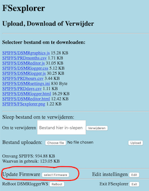
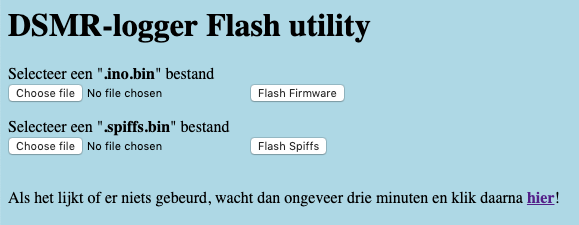

## #define USE_UPDATE_SERVER

Met deze optie wordt het mogelijk om nieuwe Firmware naar
de DSMR-logger te flashen door in de FSexplorer op de knop
[Select Firmware] te klikken

en vervolgens in de Flash Utility ..

.. op [ChooseFile] te klikken en daarna op [Flash Firmware]

Let op! Alleen voor ESP-12

Deze functionaliteit werkt alleen als je 4MB flash geheugen hebt.   
Standaard heeft iedere ESP-12 dat. 
 Je kunt een ESP-01 eventueel
upgraden naar 4MB door de aanwezige flash chip te vervangen door
een W25Q32FVSIG 32Mbit flash chip.

<table>
<tr>
<th align="left">#define</th><th align="left">Functie</th>
</tr><tr>
<td style="vertical-align:top">USE_UPDATE_SERVER</td><td>Om gebruik te kunnen maken van
zgn. "Over The Air" (OTA) updates van de firmware en het SPIFFS file systeem
moet je deze optie activeren.
 Dit kan alleen met een ESP-12 of een, met <b>4MB chip ge-upgrade</b> ESP-01 bordjes!
 '<b>Normale</b>' (1MB) ESP-01 bordjes hebben hier niet genoeg flash-geheugen voor.
</tr>
</table>

