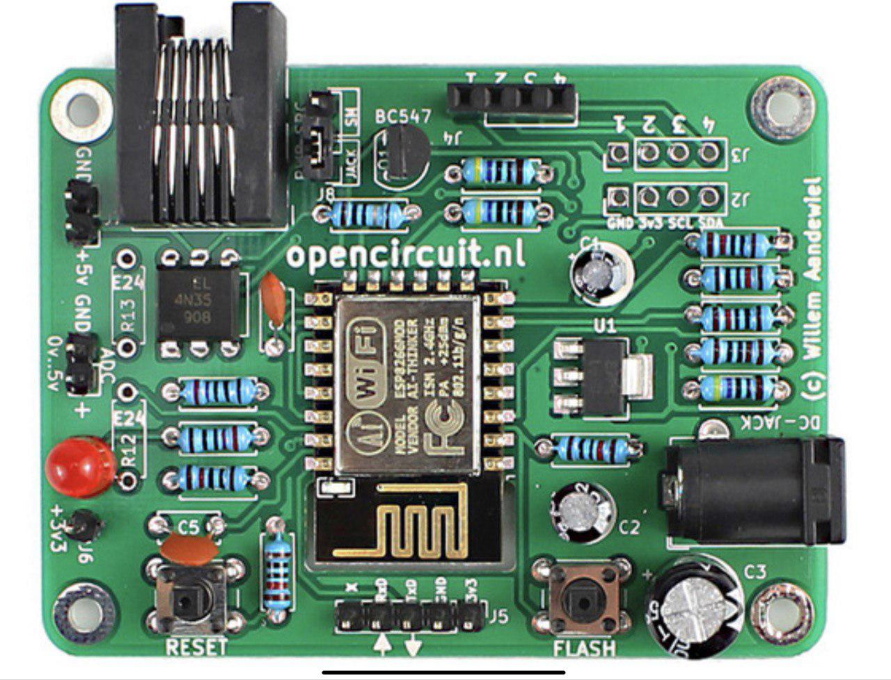
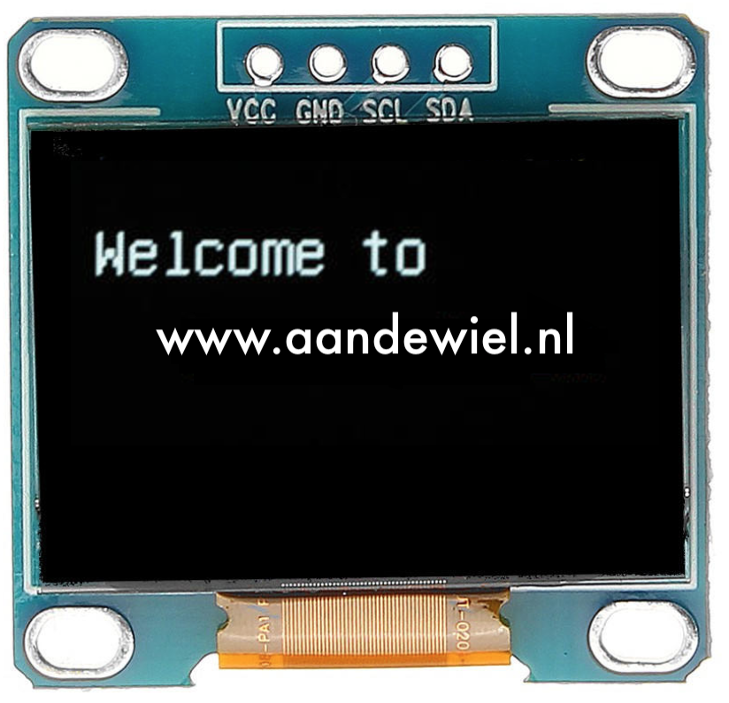

## DSMR-logger Versie 4.5

Versie 4.5 van de DSMR-logger kun je
<a href="https://opencircuit.nl/Product/Slimme-meter-uitlezer-V4.5-Geassembleerd" target="_blank">hier</a>
geassembleerde & geprogrammeerd (met v1.0.3c van de DSMRloggerWS firmware) kopen.

### OLED display
Als optie kan een OLED display 
<a href="https://opencircuit.nl/Product/11171/OLED-display-blauw-128-x-64-I2C" target="_blank">11171</a> 
worden aangesloten.

Let er wél op dat er twee versies van dit scherm worden aangeboden die op het eerste gezicht
helemaal hetzelfde lijken, maar waarvan de GND en Vcc aansluitingen omgewisseld zijn!
Bij één en dezelfde leverancier kom je beide versies tegen. Controleer dus áltijd of
jouw versie direct op de DSMR-logger kan worden aangesloten of dat je een aanpassing
moet doen!

| VCC GND SCL SDA | GND VCC SCL SDA 
:---------------------------------------:|:-----------------------------------:
 | 

Het v4.5 bordje heeft standaard de verbindingen in de volgorde [GND-VCC-SCL-SDA]
(zoals de rechter afbeelding hierboven). Mocht je een OLED scherm met omgedraaide VCC-GND
aansluitingen hebben, dan moet je aan de onderkant van het PCB de twee doorverbinding
onderbreken en twee, gekruisde, draadbruggen aanbrengen.

| Onderbreek doorverbindingen | soldeer twee draadbruggen
:---------------------------------------:|:-----------------------------------:
|                             | 3v3 --> 1, GND --> 2
 | 

### Power Selector
Met de Power Selector kun je kiezen tussen de voeding vanuit de Slimme Meter
of de voeding via de 5Volt DC Jack-Plug.

Als je een externe (5 volt!) voeding gebruikt wordt de 5 volt uit de Slimme Meter
automatisch onderbroken.

### Spanningsdeler ADC
R12 en R13 zijn optioneel en afhankelijk van welke spanning je wilt kunnen meten.

| R12 | R14 | Maximale spanning op J9 |
|:---:|:---:|:------------------------|
| 4k7 | 4k7 | 0 - 2 volt              |
| 8k2 | 3k3 | 0 - 3.3 volt            |
| 12k | 3k  | 0 - 5 volt              |
| 10k | 1k2 | 0 - 10 volt             |

 

