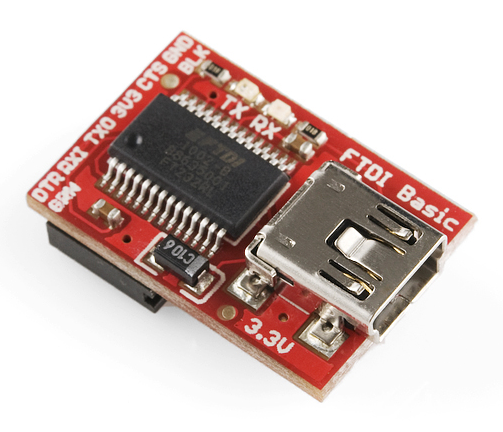

## Programmer voor de DSMR-logger V4

Er zijn verschillende manieren om de DSMR-logger van (nieuwe) firmware
te voorzien. Dit gaat het eenvoudigst *Over The Air* (OTA) maar de
eerste keer zal dit altijd bedraad moeten.

Je kunt hiervoor een FDTI-adapter gebruiken als je er maar voor
zorgt dat *Vcc*  **3v3** is!

Je moet de volgende verbindingen maken:

| Programmer | DSMR-logger | Opmerking |
|:----------:|:-----------:|:----------|
| Vcc | Vcc | LET OP! **3v3** |
| GND | GND ||
| TxD | RxD ||
| RxD | TxD ||

Uitgaande van een USB-to-Serial adapter is dit eenvoudig te realiseren
door met vier draadjes verbinding tussen de USB-to-Serial Adapter en 
de *DSMR-logger v4* te maken volgens onderstaand schema:

Omdat je hiermee de USB2Serial Adapter als een vrij "domme" programmer
gebruikt moet je in de ArduinoIDE aangeven dat je bij het uploaden
van firmware of de `data`-map geen speciaal protocol gebruikt.

In het `Tools`-menu geef je bij `Reset Method` ***None*** op.

Om nu de firmware of de `data`-map naar de *DSMR-logger v4* te flashen
moet je de *DSMR-logger v4* ***eerst*** in `Flash-mode` zetten.

Let op!

Koppel, vóórdat je de programmer op de <i>DSMR-logger v4</i> aansluit, éérst
de <i>Slimme Meter</i> los!

Dit doe je door achtereenvolgens deze handelingen uit te voeren:

1. Druk op de `FLASH` knop en houdt deze ingedrukt
2. Druk vervolgens op de `RESET` knop
3. Laat de `RESET` knop los
4. Laat als laatste de `FLASH` knop los

De DSMR-logger staat nu in `Flash-mode`  en blijft in die mode tot er firmware
of de inhoud van de `data`-map wordt ge-upload (of tot je nog een keer op de
`RESET` knop drukt).

Hierna start de DSMR-logger normaal op.

 

---

[ChartActueel]

