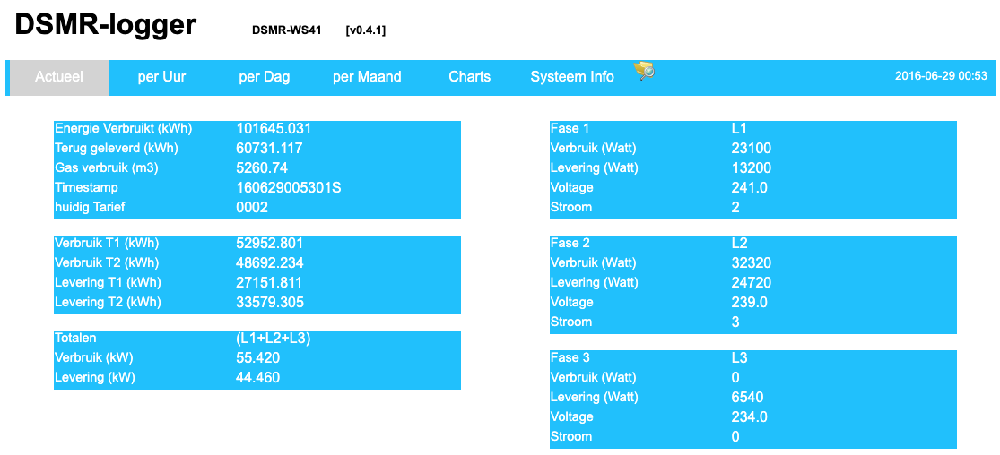

# Documentatie DSMRloggerWS 

Voor de project beschrijving ga naar [www.aandewiel.nl](https://willem.aandewiel.nl/index.php/2018/08/28/slimme-meter-uitlezer/).

## Inhoudsopgave

* - Introductie
* - Installatie
    * - [ArduinoIDE](installatieArduinoIDE.md)
    * - [ESP8266 core](installatieESP8266core.md)
    * - [Data Upload Tool](installatieDataUploadTool.md)

* - Bibliotheken
    * - [Benodigd](benodigdeBibliotheken.md)
    * - [Installeren](installatieBibliotheken.md)

* - Firmware
    * - [clonen van Github](clonenFirmware.md)
    * - [Uploaden naar ESP-01](uploadFirmware_ESP-01.md)
    * - [Uploaden Data naar ESP-01](uploadDataMap_ESP-01.md)
    * - [Uploaden naar DSMR-logger V4 board](uploadFirmware_ESP-12.md)
    * - [Uploaden Data naar DSMR-logger V4 board](uploadDataMap_ESP-12.md)

* - [Verschillen ESP-01 modules](verschillenESP8266.md)

## Introductie
Je vindt hier de documentatie voor het project DSMR-logger (Versie 4).

De DSMR-logger is een hardware en software systeem waarmee de Slimme Meter (vanaf versie 4.0)
kan worden uitgelezen. De uitgelezen data (telegrammen) worden in de DSMR-logger
opgeslagen en kunnen in de vorm van tabellen en charts worden weergegeven.

---

