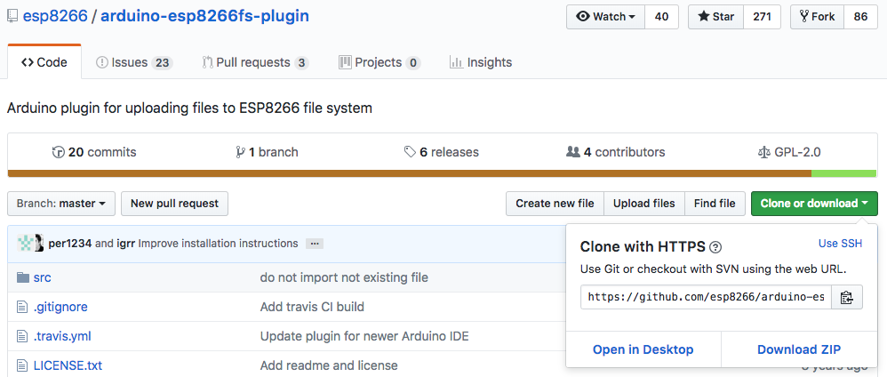
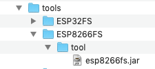
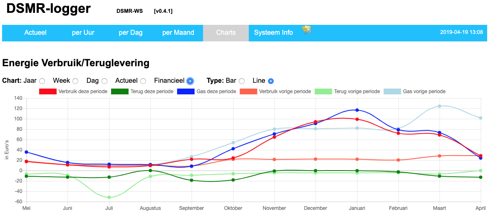

## Installatie Data Upload Tool
Eén van de mooie eigenschappen van de ESP8266 is dat er flash geheugen in zit. 
Flash geheugen is geheugen dat zijn inhoud ook zonder spanning behoud. 
Vergelijk het met een SD-kaart. Het flash geheugen is, afhankelijk van het 
bordje, 512kB tot 16MB(!) groot. Een deel van dit flash geheugen wordt gebruikt 
om jouw programma in op te slaan. Wat er over blijft kan als bestand-systeem 
worden ingericht (het zgn. *SPI Flash File Systeem* ‑SPIFFS‑).

Je kunt in je programma dit bestand-systeem niet alleen gebruiken om 
(bijvoorbeeld meet-) gegevens maar ook om de inhoud van, bijvoorbeeld, 
een web-pagina (*index.html*) of een configuratie-bestand in op te slaan.

Een *index.html* maakt dan natuurlijk onderdeel uit van je programma en ontwikkel 
je buiten de ArduinoIDE om. Om het SPI File Systeem voor dit soort bestanden te 
kunnen gebruiken moet je een `plug-in` in je Arduino Projecten map installeren. 

De plug-in haal je [hier](https://github.com/esp8266/arduino-esp8266fs-plugin/)
vandaan. Ga naar deze github pagina en klik op de groen knop..

Selecteer vervolgens [Download ZIP].

Ga nu naar je `Sketchbook Location` map en maak daarin een nieuwe map `tools` aan (als 
deze nog niet bestaat). Pak het zojuist ge-download-de zip bestand uit in deze 
`tools` map. Er wordt nu een aantal nieuwe mappen aangemaakt waar de plug-in wordt 
neergezet. Het pad ziet er ongeveer zo uit:

`<sketchbook location>/tools/ESP8266FS/tool/esp8266fs.jar`

Start de Arduino IDE opnieuw op.

Op de menu-balk zie je nu onder [`Tools`] een nieuwe optie: 
`ESP8266 Sketch Data Upload`.

Je kunt nu in de map waar je programma staat een nieuwe map met de naam `data` maken. 

De bestands-tree van de DSMRlogger firmware ziet er zo uit:

Het `ESP8266 Sketch Data Upload` tool zal alle bestanden dit in de `data`-map zitten
naar het SPIFFS van de aangesloten ESP8266 uploaden.

Ga naar: [`tools`] -> [`ESP8266 Sketch Data Upload`] 

Randvoorwaarde is natuurlijk dat het SPIFFS groot genoeg is!
In de selectie van je board moet je, 
behalve het juiste type board ook aangeven hoeveel ruimte van je Flash geheugen je 
wilt gebruiken voor het bestand-systeem (vóórdat je je programma naar de ESP8266 
upload!). 

Normaliter zou je dit zo groot mogelijk willen maken, maar als je 
“Over The Air” programma’s op je ESP8266 wilt zetten (dus zonder fysieke verbinding 
maar via WiFi) dan moet je er rekening mee houden dat je twee maal de grootte van je 
programma nodig hebt om dit te kunnen doen. Wat er overblijft kun je als 
bestand-systeem gebruiken.

 

---

[ScreenShot ChartFinancieel]
 

