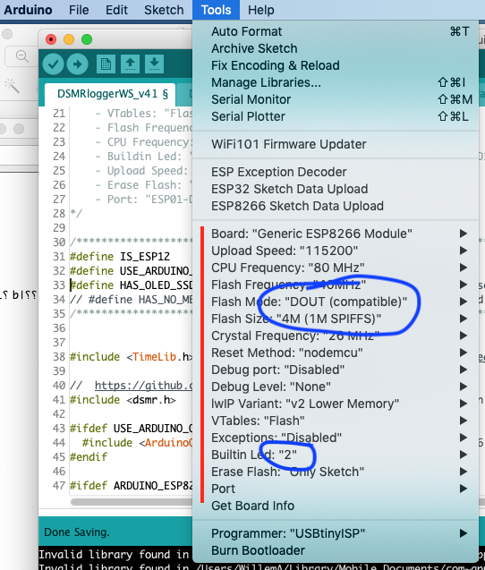

## Firmware Flashen naar DSMR-logger V4 board

Versie 4 van de DSMR-logger hardware maakt gebruik van een ESP-12
processor. Deze processor zit op de printplaat van de DSMR-logger
gesoldeerd en moet dus, op de printplaat, geflashed worden.

Om de firmware naar de **DSMRlogger Versie 4** te kunnen flashen moet deze eerst 
voor de ESP-12 geschikt worden gemaakt.

Dit doe je door in de ArduinoIDE de `#define`'s in het eerste tab-blad aan te passen.

Heb je géén Oled-display (let op de twee *slashes* voor de derde en vierde `#define`!):
```
/******************** compiler options  ********************************************/
#define IS_ESP12              // define if it's an ESP-12
#define USE_ARDUINO_OTA       // define if there is enough memory
// #define HAS_OLED_SSD1306      // define if an OLED display is present
// #define HAS_NO_METER          // define if No "Slimme Meter" is attached
/******************** don't change anything below this line ************************/
```
Heb je wel een Oled-display op de DSMR-logger aangesloten dan moeten de compiler options
als volgt worden aangepast (alleen twee *slashes* voor de vierde `#define`!):
```
/******************** compiler options  ********************************************/
#define IS_ESP12              // define if it's an ESP-12
#define USE_ARDUINO_OTA       // define if there is enough memory
#define HAS_OLED_SSD1306      // define if an OLED display is present
// #define HAS_NO_METER          // define if No "Slimme Meter" is attached
/******************** don't change anything below this line ************************/
```

Vervolgens moeten de `Boards` settings als volgt worden ingevuld:



<div class="admonition note">
<p class="admonition-title">Pas op!</p>
Koppel de DSMR-logger los van de <i>Slimme Meter</i> vóórdat je de DSMR-logger
op de programmer aansluit!!
</div>

Sluit de USB->ESP12 programmer aan op de `Program`-header van de *DSMR-logger v4*. 

1. Druk de `FLASH` knop in en houd deze ingedrukt
2. Druk op de `RESET` knop 
3. Laat de `RESET` knop los
4. Laat de `FLASH` knop los

De *DSMR-logger v4* staat nu in Flash-mode en blijft in die mode tot er gegevens vanaf
de programmer naar de DSMR-logger zijn overgebracht óf tot je nog een keer op de
`RESET` knop drukt.

Vergeet niet in de ArduinoIDE de `Port` te selecteren waarop je de USB->ESP12 
programmer hebt aangesloten en druk op het *Compile and Upload* icoon.


<br>

---
<center  style="font-size: 70%">[ScreenShot DSMR-PCB]</center><br>
<center></center>
