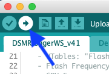

## Firmware Flashen naar ESP-12

Versie 4 van de DSMR-logger hardware maakt gebruik van een ESP-12
processor. Deze processor zit op de printplaat van de DSMR-logger
gesoldeerd en moet dus, op de printplaat, geflashed worden.

Om de firmware naar de ESP-12 te kunnen flashen moet deze eerst 
voor de ESP-12 geschikt worden gemaakt.

Dit doe je door in de ArduinoIDE de `#defines` in het eerste tab-blad aan te passen.

Heb je géén Oled-display:
```
/******************** compiler options  ********************************************/
#define IS_ESP12              // define if it's an ESP-12
#define USE_ARDUINO_OTA       // define if there is enough memory
// #define HAS_OLED_SSD1306      // define if an OLED display is present
// #define HAS_NO_METER          // define if No Meter is attached
/******************** don't change anything below this line ************************/
```
Heb je wel een Oled-display op de DSMR-logger aangesloten dan moeten de compiler options
als volgt worden aangepast.
```
/******************** compiler options  ********************************************/
#define IS_ESP12              // define if it's an ESP-12
#define USE_ARDUINO_OTA       // define if there is enough memory
#define HAS_OLED_SSD1306      // define if an OLED display is present
// #define HAS_NO_METER          // define if No Meter is attached
/******************** don't change anything below this line ************************/
```

Vervolgens moeten de `Boards` settings als volgt worden ingevuld:


Sluit nu de USB->ESP12 programmer aan op de `Program`-header van de DSMR-logger. 

1. Druk nu de [Flash] knop in en houd deze ingedrukt
2. Druk nu op de [Reset] knop en laat deze weer los
3. Laat nu de [Flash] knop los

De DSMR-logger staat nu in Flash-mode en blijft in die mode tot er gegevens vanaf
de programmer naar de DSMR-logger zijn overgebracht óf tot je nog een keer op de
[Reset] knop drukt.

Vergeet niet in de ArduinoIDE de `Port` te selecteren waarop je de USB->ESP12 
programmer hebt aangesloten en druk op het Compile and Upload icoon.




