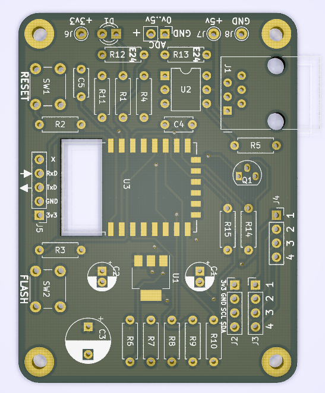

## Firmware Flashen naar DSMR-logger V4 board

Versie 4 van de DSMR-logger hardware maakt gebruik van een ESP-12
processor. Deze processor zit op de printplaat van de DSMR-logger
gesoldeerd en moet dus, op de printplaat, geflashed worden.

Om de firmware naar de **DSMRlogger Versie 4** te kunnen flashen moet deze eerst 
voor de ESP-12 geschikt worden gemaakt.

Dit doe je door in de ArduinoIDE de `#define`'s in het eerste tab-blad aan te passen.

Heb je géén Oled-display (let op de twee *slashes* voor de tweede, derde en vierde `#define`!):
```
/******************** compiler options  ********************************************/
#define IS_ESP12              // define if it's an ESP-12
//  #define USE_ARDUINO_OTA       // define if there is enough memory (DEPRECIATED)
#define USE_UPDATE_SERVER     // define if updateServer to be used and there is enough memory
// #define HAS_OLED_SSD1306      // define if an OLED display is present
//  #define HAS_NO_METER          // define if No "Slimme Meter" is attached
/******************** don't change anything below this comment **********************/

```
Heb je wel een Oled-display op de DSMR-logger aangesloten dan moeten de compiler options
als volgt worden aangepast (alleen twee *slashes* voor de tweede en vierde `#define`!):
```
/******************** compiler options  ********************************************/
#define IS_ESP12              // define if it's an ESP-12
//  #define USE_ARDUINO_OTA       // define if there is enough memory (DEPRECIATED)
#define USE_UPDATE_SERVER     // define if updateServer to be used and there is enough memory
#define HAS_OLED_SSD1306      // define if an OLED display is present
//  #define HAS_NO_METER          // define if No "Slimme Meter" is attached
/******************** don't change anything below this comment **********************/

```

Vervolgens moeten de `Boards` settings als volgt worden ingevuld:

|   | Instelling        |Waarde|
|:-:|:------------------|:-----|
|   | Board             | "Generic ESP8266 Module" |
|   | Upload Speed      | "115200" |
|   | CPU Frequency     | "80MHz" |
|   | Flash Frequency   | "40MHz" |
|   | Flash Mode        | "DOUT (compatible)" |
|   | Flash Size        | "4M (1M SPIFFS)" |
|   | Crystal Frequency | "26MHz" |
|   | Reset Method      | "None" |
|   | Debug Port        | "Disabled" |
|   | Debug Level       | "None" |
|   | IwIP Variant      | "v2 Lower Memory" |
|   | VTables           | "Flash" |
|   | Exeptions         | "Disabled" |
|   | Builtin Led       | "2" |
|   | Erase Flash       | "Only Sketch"<br>(First Time: "All Flash Contents") |
|   | Port              | Bedraad: "Serial Port" <br> OTA: &nbsp; &nbsp; &nbsp; &nbsp; "Network port" |


<hr>
### Firmware Bedraad Flashen
<div class="admonition note">
<p class="admonition-title">Pas op!</p>
Koppel de DSMR-logger los van de <i>Slimme Meter</i> vóórdat je de DSMR-logger
op de programmer aansluit!!
</div>

Sluit de USB->ESP12 programmer aan op de `Program`-header van de *DSMR-logger v4*. 

1. Druk de `FLASH` knop in en houd deze ingedrukt
2. Druk op de `RESET` knop 
3. Laat de `RESET` knop los
4. Laat de `FLASH` knop los

De *DSMR-logger v4* staat nu in Flash-mode en blijft in die mode tot er gegevens vanaf
de programmer naar de DSMR-logger zijn overgebracht óf tot je nog een keer op de
`RESET` knop drukt.

Vergeet niet in de ArduinoIDE de `Port` te selecteren waarop je de USB->ESP12 
programmer hebt aangesloten en druk op het *Compile and Upload* icoon.


<hr>
### Firmware *Over The Air* Flashen
Bij het *Over The Air* flashen van de firmware of `data`-map kan de 
DSMR-logger v4 gewoon op de Slimme Meter aangesloten blijven.

Alle instellingen voor de DSMRloggerWS firmware blijven gelijk aan
de bedraade methode van flashen. 

Als je in het `tools` menu `Port` selecteerd, zie je het IP-adres 
van de DSMR-logger (in het plaatje is dat 192.168.12.106).


Onthou dat IP-adres!.

Vervolgens moet je niet op het &nbsp; `Compile & Upload`-Icoon
&nbsp;  &nbsp;
klikken maar op het `Verify`-icoon
&nbsp;  &nbsp;

Als de firmware gecompileerd is klik je op de DSMR-logger pagina op het 
 icoontje.

In de FSexplorer klik je op de knop `select Firmware`

<center></center>

Er verschijnt nu een nogal minimalistisch scherm waarin je op de knop `Choose File`
moet klikken.

<center></center>

Selecteer uit het `popUp scherm` dat nu verschijnt het binary file dat je als 
nieuwe firmware wilt uploaden (het is een file waarvan de naam op `.bin` eindigt). 
<br />

Vervolgens klik je op de knop `Update`.

<center></center>

Na enige tijd krijg je de melding dat de upload is geslaagd en dat de DSMR-logger
opnieuw opstart. Standaard wacht de upload niet lang genoeg om de DSMR-logger ook
daadwerkelijk op te laten starten (je kunt dit in de bibliotheek wel aanpassen)
dus uiteindelijk zul je de webpagina handmatig moeten reloaden.


Kijk ook [hier](uploadOTA-bug.md).


<br>

---
<center  style="font-size: 70%">[DSMR-PCB]</center><br>
<center></center>
