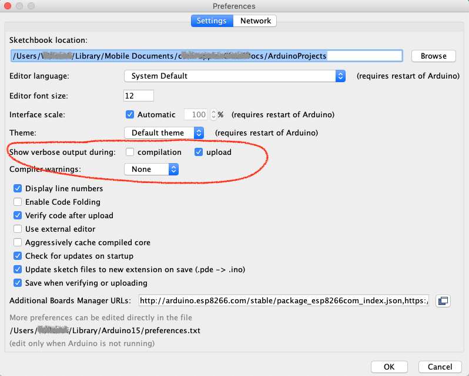

## Upload Over The Air (bug?)

Het lijkt erop dat er een bug zit in de toolchain van de ArduinoIDE
voor wat betreft het `Over The Air` uploaden van omvangrijke Firmware.

Als je probeert om de DSMRloggerWS firmware via de ArduinoIDE te
uploaden krijg je consequent een popUp window te zien waarin
gevraagd wordt een password in te voeren:


Waarna, *wat je ook klikt of invult* je de volgende foutmelding in
de ArduinoIDE te zien krijgt:


.. en het verhaal stopt.

Het popUp window is een bekend fenomeen in de Arduino wereld omdat
het in verschillende situaties voor kan komen. Helaas wordt er
nergens een échte oplossing gegeven.

Maar gelukkig is er voor dít probleem een *Work Around*!

Het blijkt, dat als je de instructie om de firmware te uploaden
naar de ESP8266 op de command line handmatig invoert de OTA
upload wél goed gaat!

Inplaats van op het `Compile & Upload` icon &nbsp;  &nbsp; te klikken 

moet je in de IDE op het `Verify` icon &nbsp;  &nbsp; klikken.

Daarná kun je in een `terminal` of `command` window het script `espota.py` gebruiken
om de gecompileerde binary naar de ESP8266 over te zetten.

In de `bin` directory van de repository heb ik een Python programma
gezet die dit iets eenvoudiger maakt.

<hr>
Om, voor de vervog stappen, de goede informatie in het log-venster van de 
ArduinIDE tezien te krijgen moet in de `Preferences` de 
***Show Verbose Output During: upload***
zijn aangevinkt:




<hr>
#### otaUpload programma
Je roept het programma als volgt aan:
```
otaUpload <IP adres van de ESP8266>
```


```
$  otaUpload 192.168.12.161
otaUpload : [ 1 ] [ DSMRloggerWS_v42.ino.bin ]
otaUpload : bin File Found  DSMRloggerWS_v42.ino.bin
otaUpload : Last Modified   Tue Apr 23 14:37:13 2019
----------------------------------------------------------------------------
otaUpload : espota -i  192.168.12.161  -f  DSMRloggerWS_v42.ino.bin
Uploading................................................................
.........................................................................
.........................................................................
Done ..
$ 

```

Om het programma in jouw omgeving te laten werken moet je een aantal regels
aanpassen.
```
  1  #!/usr/bin/env python
  2  #
  3  # this script will upload an arduino compiled sketch
  4  # to an WiFi connected device
  5  #
  6  #------ where pyton is located -----------------------------
  7  PYTHON='/usr/local/bin/python'
  8  #
  9  #------ this is the Sketch Location (see preferences.txt) --
 10  BUILDPATH = "/Users/WillemA/tmp/Arduino/build"
 11  #
 12  #------ Edit this ESPOTAPY to point to the location --------
 13  #------ where your espota.py file is located        --------
 14  ESPOTAPY  = '/Users/WillemA/Library/Arduino15/packages/esp8266/hardware/esp8266/2.5.0/tools/espota.py'
 15  #
 16  #------ do not change anything below this line! ------------
 17  #
```
De meeste regels zijn commentaar ("#"). Het gaat dan ook alleen om de variabelen die in
de regels 7, 10 en 14 een waarde krijgen.

<hr>
#### PYTHON
Voor unix achtige OS'n moet hier het volledige pad naar de python binary staan.   
In een Windows omgeving is het voldoende om de regel zo aan te passen:
```
PYTHON='python'
```

<hr>
#### BUILDPATH
```
#------ this is the Sketch Location (see preferences.txt) --
BUILDPATH = "/Users/User/tmp/Arduino/build"

```
`BUILDPATH` is de variabele die aangeeft waar in jouw setup van de ArduinoIDE
de gecompileerde firmware wordt neergezet.  
Je kunt erachter komen wat het build-pad bij jouw computer is door een simpele
Sketch `bedraad` te uploaden.
Je ziet dan zoiets als dit onderin het log-venster verschijnen (voor de duidelijkheid
heb ik de regel waar het omgaat in stukjes geknipt):
```
Sketch uses 307352 bytes (29%) of program storage space. Maximum is 1044464 bytes.
Global variables use 28424 bytes (34%) of dynamic memory, leaving 53496 bytes for local variables. Maximum is 81920 bytes.
/Users/WillemA/Library/Arduino15/packages/esp8266/tools/esptool/2.5.0-3-20ed2b9/esptool \
          -vv \
          -cd none -cb 115200 -cp /dev/cu.usbserial-A501B8OQ \
          -ca 0x00000 \
          -cf /Users/User/tmp/Arduino/build/BasicOTA.ino.bin 

```
Achter `-cf` staat het pad waar het om gaat. Op mijn computer is
dit blijkbaar `/Users/User/tmp/Arduino/build/`.  
In een Windows omgeving is dit waarschijnlijk:
```
BUILDPATH = 'C:\Users\(YourLoginName)\AppData\Local\Temp\arduino_build_207737\'
```
Het laatste deel (arduino_build_207737) geeft de versie van de ArduinoIDE aan die
je gebruikt en kan bij jou dus iets anders zijn.


<hr>
#### ESPOTAPY
```
#------ Edit this ESPOTAPY to point to the location --------
#------ where your espota.py file is located        --------
ESPOTAPY  = '/Users/User/Library/Arduino15/packages/esp8266/hardware/esp8266/2.5.0/tools/espota.py'

```
De variabele `ESPOTAPY` geeft aan waar op jouw systeem het `espota.py` programma staat.  
In een Windows omgeving is dit waarschijnlijk:
```
ESPOTAPY = 'C:\Users\(YourLoginName)\Documents\arduino\tools'
```

Als je de Sketch `BasicOTA` Over The Air upload naar een ESP8266 dan zie je in het
log-venster onderin de ArduinoIDE een regel verschijnen die `espota.py` aanroept. 
```
Sketch uses 307352 bytes (29%) of program storage space. Maximum is 1044464 bytes.
Global variables use 28424 bytes (34%) of dynamic memory, leaving 53496 bytes for local variables. Maximum is 81920 bytes.
python /<path>/espota.py -i 192.168.12.161 -p 8266 --auth= -f /Users/WillemA/tmp/Arduino/build/BasicOTA.ino.bin 
Uploading............................................................................................
.....................................................................................................
.....................

```
Dit deel van de regel `/<path>/espota.py` moet je achter `ESPOTAPY` invullen.

Tenslotte moet je het `otaUpload` programma in een map/directory zetten die in de `PATH` variabele
voorkomt of je moet het programma steeds aanroepen met de volledige pad-naam waar het programma
staat (bijvoorbeeld `.\otaUpload`).


<hr>
### preferences.txt
Ergens in het `preference.txt` bestand staan deze instellingen die aangeven
hoe je binaries worden *ge-build* en waar ze worden neergezet.
```
.
build.path=/Users/User/tmp/Arduino/build
build.verbose=true
build.warn_data_percentage=75
.
.
```
Het gaat om de vaiabele `build.path`. Ik heb deze op mijn computer aangepast 
zodat de Sketches altijd op dezelfde plek in mijn systeem worden 
gecompileerd -onafhankelijk van de versie van de ArduinoIDE-.   
Dit commentaar vond ik op github m.b.t. de `build.path` variabele:
```
# temporary build path, normally this goes into the default
# "temp" folder for that platform (as defined by java)
# but this can be used to set a specific file in case of problems
#build.path=build

```
Als de variabel **niet** ge-set wordt (er staat een `#` voor of hij ontbreekt
in het `preferences.txt` bestand) dan wordt de standaard, door java bepaalde,
`temp` directory gebruikt.

<div class="admonition note">
<p class="admonition-title">java.io.tmpdir</p>
The default value is typically "/tmp", or "/var/tmp" on Unix-like platforms. 
On Microsoft Windows systems the java.io.tmpdir property is typically "C:\\WINNT\\TEMP".
.. or .. at Windows 10 it seems to be "AppData\Local\Temp\" 
or "\Users\\(YourLoginName)\AppData\Local\Temp\"
</div>
